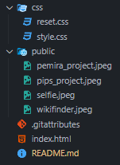
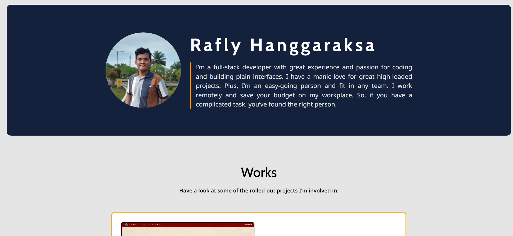
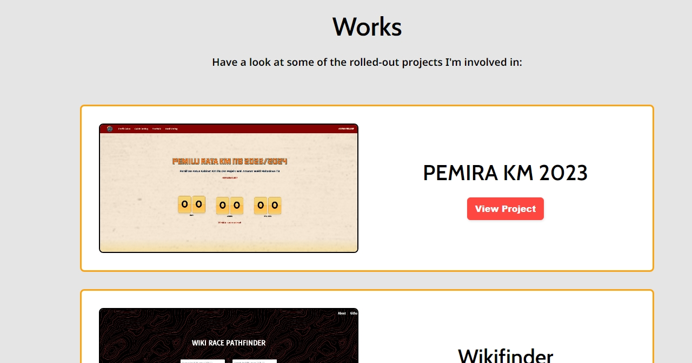
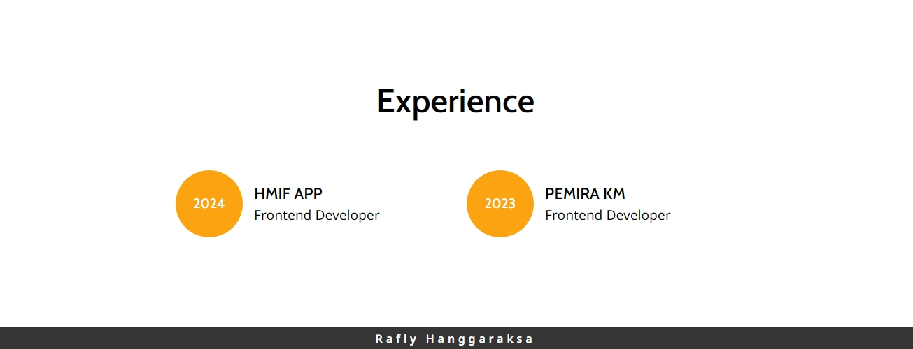

# 🧑🏻 Portfolio Website
This is a personal portfolio website built using vanilla HTML, CSS. It showcases personal information, past projects, and experience.

## 📋 Table of Contents
- Live Demo
- Features
- Technologies Used
- Project Structure
- How to Run
- Customization
- Screenshots

## 🍿 Live Demo
- You can view the live version of the portfolio [here](https://raflyhangga.github.io/Portofolio/).

## 🌟 Features
1. **Hero Section**: Introduction and personal details (photo, name, bio).
2. **Projects Section**: A collection of past projects with descriptions and links to live demos or repositories.
3. **Experience Section**: List of professional experiences with roles and dates.
4. **Responsive Design**: Works on both desktop and mobile devices.

## 🔨 Technologies Used
- **HTML5**: Semantic markup to structure the portfolio.
- **CSS3**: For layout and styling (using Flexbox and media queries).

## 🏗️ Project Structure


## 🏃🏻‍♂️‍➡️ How to Run
Clone this repository:

```
git clone https://github.com/raflyhangga/Portofolio
```
Navigate to the project folder:

```
cd Portofolio
```

Open the ```index.html``` file in your browser to view the website locally.

## ✏️ Customization
You can easily customize this portfolio by updating the following sections:

- **Personal Info**: Update the name, bio, and image in the ```<header>``` section of ```index.html```.
- **Works**: Add or modify projects in the ```<section>``` for works in ```index.html```. Update the image and description as needed.
- **Experience**: Update the experience timeline in the ```<section>``` for experience.
CSS modifications can be made in the ```css/style.css file``` to change layout, colors, fonts, etc.

## 📸 Screenshots





